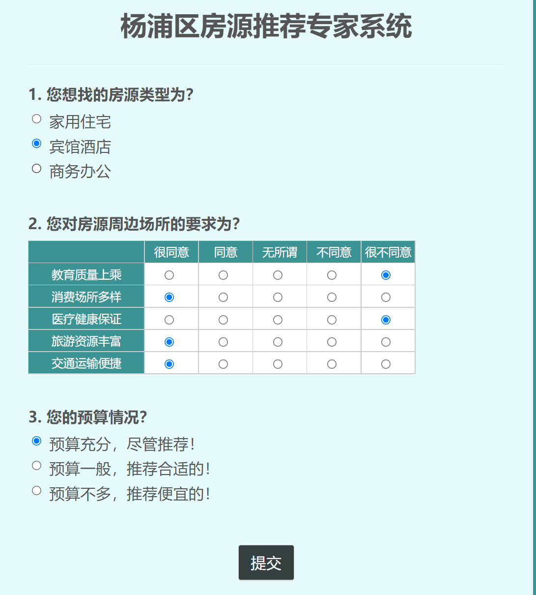
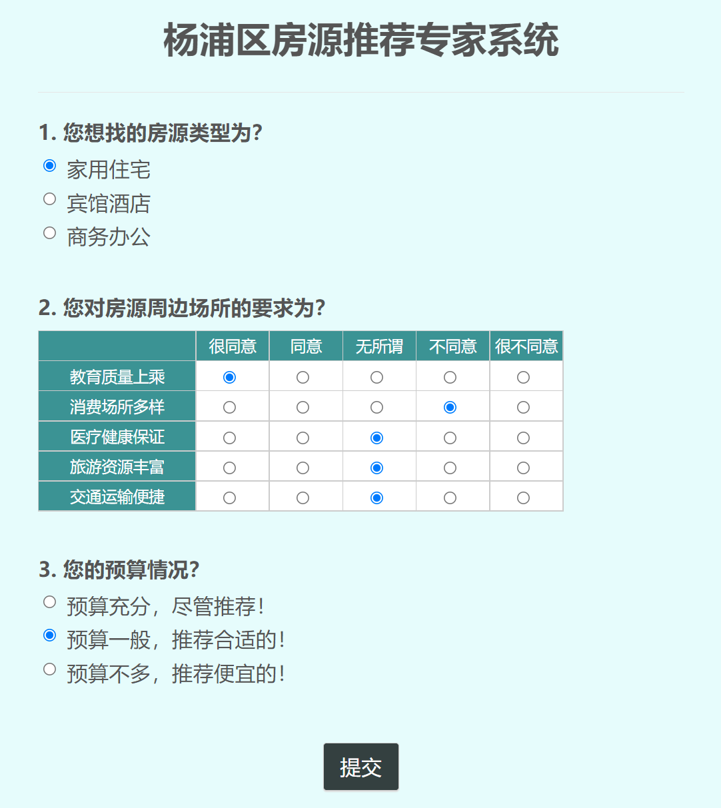
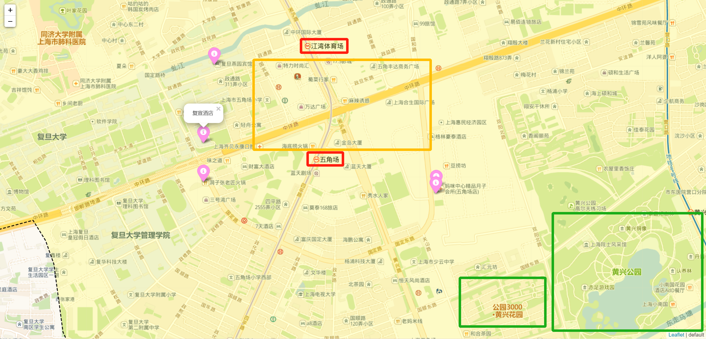
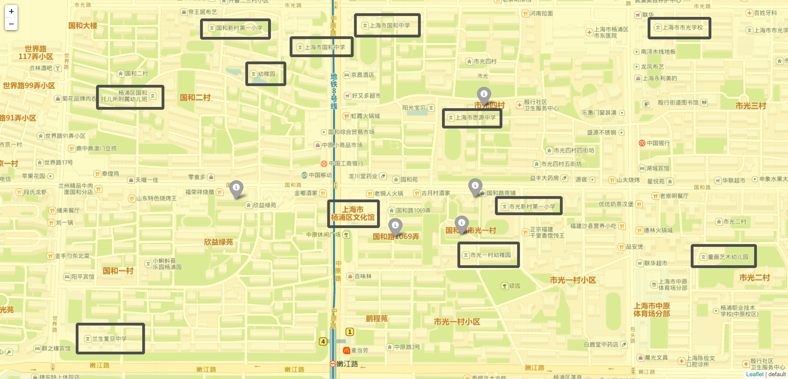

### 基于模糊推理的房源区位分析与推荐

2022年人工智能课程项目

> 报告全文见report/main.tex

#### 摘要

随着中国经济飞跃式发展，城市化水平不断提高，国民对房源需求的个性化趋势也越来越明显。然而，房源所处的区位信息往往无法第一时间被相关群体掌握，客观上造成了一定的信息不对等。同时，庞杂的房源数据也使得个性化需求的匹配难以进行。本研究搭建了一个基于模糊推理的房源推荐专家系统，并使用上海市杨浦区3万多条数据进行实验。系统实现了对房源区位条件的综合分析，一定程度上解决了用户的个性化房源区位需求。

#### 运行效果

<table>
<tr>
    <td></td>
    <td></td>
</tr>
<tr>
    <td colspan="2"></td>
</tr>
<tr>
    <td colspan="2"></td>
</tr>
</table>

#### 参考文献

[1] 胡奕斐. 购房消费行为分析[J]. 杭州: 浙江工业大学, 2001.

[2] 孙聪, 刘霞, 姚玲珍. 新时代住房供应如何契合租购群体的差异化需求?[J]. 财经研究, 2019, 45(1): 75-88.

[3] Yin Z, Wu Y, Jin Z, et al. Research on livable community evaluation based on GIS[C]//IOP conference series: Earth and environmental science. IOP Publishing, 2018, 108(4): 042075.

[4] Score W. Walk score methodology[J]. Accessed April, 2014, 24.

[5] Journois M, Story R, Gardiner J, et al. python-visualization/folium v0. 12.1[J]. Zenodo.

[6] Warner J, Sexauer J, Unnikrishnan A. JDWarner/scikit-fuzzy: Scikit-Fuzzy version 0.4. 2[J]. Zenodo, 2019.